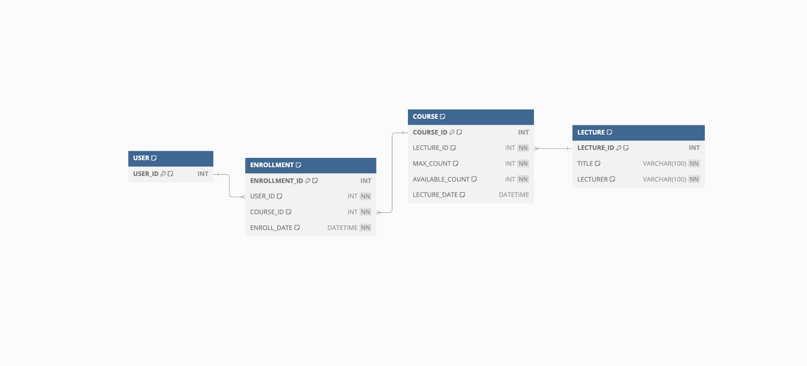

## 특강 신청 서비스 ERD

### 구성
- 회원 `USER`
- 강의 `LECTURE`
- 특강 `COURSE`
- 특강 신청 `ENROLLMENT`

하나의 강의에 대해 여러번의 특강이 배정될 것을 감안해 강의 테이블과 특강 테이블을 분리   
신청자수 관리위해 서브쿼리로 계산하기보다 `COURSE` 테이블에 신청가능 인원인 `AVAILABLE_COUNT` 컬럼 추가
   
   
### Relationship
- `USER` - `ENROLLMENT`: **1:N**. 하나의 사용자는 여러개의 특강을 신청할 수 있음
- `LECTURE` - `COURSE`: **1:N**. 하나의 강의는 여러개의 특강에 배정될 수 있음
- `COURSE` - `ENROLLMENT`: **1:N**. 하나의 특강에 여러명의 사용자가 신청할 수 있음

